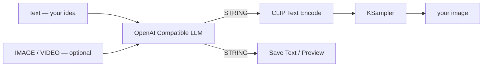

<div align="center">

# ComfyUI — OpenAI Compatible LLM

**One node. Any OpenAI-compatible endpoint. Text, images and video in — text out.**

[](LICENSE)
[](https://www.python.org/)
[](https://github.com/comfyanonymous/ComfyUI)

Point it at OpenAI, OpenRouter, Groq, Together, LM Studio, Ollama, vLLM, llama.cpp —
anything speaking the OpenAI API. It reads the model list off the endpoint itself,
and grows a new text input every time you plug one in.

</div>

---

## What you'd use it for

An LLM inside your graph, wired to the rest of the workflow. The output is a plain `STRING`,
so it drops straight into **CLIP Text Encode**, **Save Text**, or any node taking text.

| | Use case | How |
|---|---|---|
| ✍️ | **Turn a scribble into a real prompt** | Feed `"a cat"` in, get a full lighting/lens/composition prompt out. Put the style rules in `system_prompt` so they apply every run. |
| 🏷️ | **Caption images for LoRA datasets** | Connect an `IMAGE` batch — every frame is sent as its own image, so one run captions the whole batch. |
| 🔁 | **Describe, tweak, regenerate** | Caption an existing image, edit the description, send it back to a sampler. Img2img without guessing what the model saw. |
| 🎲 | **A different prompt every queue** | Set *control after generate* to `randomize` on `seed` and each run gives you a fresh variation. |
| 🌍 | **Write prompts in your own language** | `system_prompt`: "translate to English, keep it as a prompt". |
| 🧩 | **Merge subject + style + camera** | Wire three text sources into `text_1..3` and let the model blend them into one coherent prompt instead of gluing strings together. |
| 🚫 | **Generate matching negatives** | A second node with a "list what should not appear" system prompt. |
| 🔍 | **Judge your own output** | Send the generated image back to a vision model and ask what's wrong with it. |
| 🏠 | **Run it all for free** | Point `base_url` at Ollama or LM Studio. Same node, no API bill. |



## Why this node

- **Any endpoint** — one node instead of one per provider. Swap `base_url` and keep the graph.
- **Real model list** — fetched from `GET /models`, not a hardcoded dropdown that rots.
- **Inputs that grow** — connect `text_1`, and `text_2` appears. Up to 16.
- **Sees images and video** — not just a text box.
- **Free iteration** — `reuse_last_result` freezes the answer so you can tune everything downstream without paying for another token.
- **Keys stay out of your workflow file** — read them from the environment instead.

## Install

Clone into your `custom_nodes` folder and install the one dependency, then restart ComfyUI:

```bash
cd ComfyUI/custom_nodes
git clone https://github.com/aiko929/comfyui-openai-compatible.git
pip install -r comfyui-openai-compatible/requirements.txt
```

On the Windows portable build, use the bundled Python for the last step:

```bash
python_embeded\python.exe -m pip install -r ComfyUI\custom_nodes\comfyui-openai-compatible\requirements.txt
```

Requires Python 3.10+. The node appears under **api/text**, or search for "OpenAI" in the node menu.

## Quick start

1. Add **OpenAI Compatible LLM** and set `base_url` — the part *before* `/models` and
   `/chat/completions`. Hosted providers look like `https://api.example.com/v1`; a local server is
   typically `http://localhost:11434/v1`.
2. Paste your key into `api_key` (`sk-...`), or leave it empty and use an environment variable
   (see [API keys](#api-keys)).
3. Press **Refresh models**. The `model` dropdown fills from `GET {base_url}/models`. It also
   refreshes when you change the URL or key, and when a workflow loads.
4. Connect a STRING into `text_1` — a new slot appears each time you connect one, up to 16.
5. Wire the `text` output wherever you need it.

A prompt-expander in one setting — put this in `system_prompt`:

> You rewrite short image ideas into detailed prompts. Reply with the prompt only, no preamble,
> under 60 words. Keep the subject the user gave you.

Then `text_1` = `a cat`, and the output goes into CLIP Text Encode.

## Inputs

| Input | Notes |
|---|---|
| `base_url` | Endpoint root. Trailing `/` and a missing `https://` are handled. |
| `api_key` | See [API keys](#api-keys). |
| `model` | Populated by **Refresh models**. |
| `text_1...text_16` | Prompt parts. Empty ones are skipped. Slots grow as you connect them. |
| `system_prompt` | Optional system message — where the standing instructions go. |
| `input_mode` | `join` (default): all texts become one user message. `separate_messages`: one user message per input. |
| `separator` | Used by `join` mode. `\n` and `\t` become real newlines/tabs. Default `\n\n`. |
| `temperature` | `-1` omits the field entirely (useful for reasoning models that reject it). |
| `max_tokens` | `0` leaves it to the provider. |
| `timeout` | Seconds to wait for the response. |
| `seed` | Never sent to the API — it only decides whether the node re-runs or returns its cached answer. Set *control after generate* to `randomize` to always call the API. |
| `reuse_last_result` | **On**: output the answer from last time, without calling the API. **Off**: generate normally. [Details below](#reusing-the-last-answer). |
| `images` | Optional IMAGE input. Every frame of the batch is sent as its own image. Needs a vision model. |
| `video` | Optional VIDEO input, inlined as a `video_url` block. Provider-specific. |
| `image_detail` | OpenAI `detail` hint: `auto`, `low` (much cheaper), `high` (reads fine print). |
| `image_format` | `jpeg` (default), `png` (lossless, better for screenshots and text), `webp`. |
| `image_max_side` | Downscale so the longest side is at most this many pixels. `0` sends full size. |
| `video_max_mb` | Refuse to upload a video bigger than this, instead of failing at the provider. Default 20. |

**Output:** `text` (STRING) — the model's answer.

## Images and video

Connect an IMAGE to `images` and the prompt is sent as OpenAI-style content blocks — a text block
followed by one `image_url` block per frame, as a `data:` URL. A batch of 4 becomes 4 images in one
message. With `input_mode = separate_messages` the media is attached to the **last** user message.

With nothing connected to `images` or `video`, `content` stays a plain string rather than a block
array, so providers that only accept the simple text shape keep working.

Video is sent as a `video_url` block. **This is not part of the OpenAI spec** — providers that
accept video at all use this shape, and everything else rejects the request with a readable error.
`video_max_mb` defaults to 20 because provider ceilings tend to sit around there; the size is
checked locally so you get an error immediately instead of after a long upload.

<details>
<summary><b>Which of your models accept images or video?</b></summary>

The `/models` endpoint doesn't report modalities, and provider docs are usually vague, so ask the
endpoint directly. `tools/probe_modalities.py` sends a small image (and a short generated video
clip) to each model and reports which ones accept it:

```bash
python tools/probe_modalities.py --api-key sk-your-key
```

Useful flags: `--only gpt,gemini` to probe just some models, `--modalities image` to skip video,
`--json report.json` to save the table. It reads `OPENAI_COMPATIBLE_API_KEY` if you omit
`--api-key`. It makes a couple of small requests per model, so it costs a few tokens.

Support is per-model, not per-provider, so run the probe against the models you actually use.

</details>

## Reusing the last answer

Switch `reuse_last_result` on and the node stops calling the API: it outputs whatever it produced
last time, even if the prompts, model or system message changed. Switch it off and the next run
generates again. Useful for iterating on the rest of a workflow without paying for tokens or
waiting on the model, and for keeping an answer you liked while you change something downstream.

<details>
<summary><b>How the memory behaves</b></summary>

- The answer is kept on disk, in `user/openai_compatible/last_results.json`, so it survives a
  ComfyUI restart.
- It is stored per node **and** per workflow (keyed by the workflow's uuid plus the node id), so
  two copies of the node — or the same workflow opened twice — never hand each other their text.
- If the toggle is on but nothing has been stored yet, one answer is generated and kept, rather
  than failing.
- While the toggle is on, `model` and `base_url` are not even looked at, so a stale model
  selection or an empty key won't stop the workflow.
- Turning it off does not erase anything: the next successful generation overwrites the stored
  answer.

</details>

## API keys

> [!WARNING]
> The key is stored in the workflow JSON, so a shared workflow leaks it.

To avoid that, leave `api_key` empty and set an environment variable instead:

- `OPENAI_COMPATIBLE_API_KEY`, or
- `OPENAI_API_KEY`

Or point at a specific variable by typing `env:MY_VARIABLE` into the widget.

## Troubleshooting

| Symptom | Fix |
|---|---|
| **"Could not load models"** | Check the URL ends in `/v1` (or whatever your provider uses) and the key is valid. The exact HTTP status and body are in the toast and the ComfyUI console. |
| **Model list empty after loading a workflow** | The list saved in the workflow shows first, then refreshes. Press **Refresh models** if the endpoint was unreachable. |
| **`404` on `/chat/completions`** | Some providers use a different path prefix — put the full root in `base_url`. |
| **Provider rejects `temperature`** | Set it to `-1`. |
| **Same text every run** | `reuse_last_result` is on. If it's off, ComfyUI is reusing its own cached output because nothing upstream changed — bump `seed`. |
| **`400` about image/content type** | That model is text-only. Run `tools/probe_modalities.py` to see which of yours take images. |
| **Image request huge or timing out** | Set `image_max_side` to e.g. `1536`, keep `image_format = jpeg`, use `image_detail = low` if you only need the gist. |

<details>
<summary><b>How the model list works</b></summary>

The frontend extension (`web/openai_compatible.js`) posts the URL and key to the
`/openai_compatible/models` route added by this package; ComfyUI's Python process calls
`GET {base_url}/models` and returns the ids. This avoids browser CORS restrictions, and the key
never leaves your machine except towards your endpoint. Results are cached for 30 s; the
**Refresh models** button always bypasses that cache.

</details>

<details>
<summary><b>Project layout</b></summary>

```
comfyui-openai-compatible/
  __init__.py                     extension registration + WEB_DIRECTORY
  nodes.py                        the node
  client.py                       async HTTP client for /models and /chat/completions
  routes.py                       POST /openai_compatible/models
  store.py                        on-disk memory of each node's last answer
  media.py                        IMAGE / VIDEO -> data URLs and content blocks
  tools/probe_modalities.py       asks your endpoint which models accept images/video
  web/openai_compatible.js        model dropdown + refresh button
```

</details>

## License

[MIT](LICENSE).
